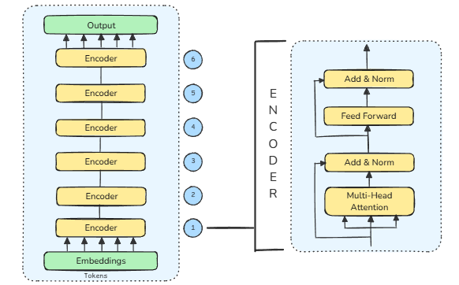

# Co-BERT: A Comprehensive Evaluation of Tokenization Techniques in Code-Switching Environments

[](https://opensource.org/licenses/MIT)

This repository contains the implementation and resources for our research on tokenization techniques for code-mixed Indian languages. We evaluate three tokenization approaches (BPE, WordPiece, and SentencePiece) across three code-mixed language pairs (Tanglish, Kanglish, and Hinglish).

## 📝 Paper Abstract

Code-mixed languages, characterized by the blending of two or more languages in a single utterance, pose significant challenges in natural language processing (NLP). Tokenization plays a crucial role in handling such linguistically complex data effectively. 

In this study, we comprehensively evaluate three tokenization techniques—WordPiece, SentencePiece, and Byte Pair Encoding (BPE)—across three distinct code-mixed languages: Tanglish, Kanglish, and Hinglish. By leveraging a dataset collected from YouTube video transcriptions and transliterated using AI4Bharat's Bhashini, we systematically determine the optimal tokenizer for each language based on loss function analysis. The results provide nuanced insights into the efficiency of different tokenization strategies for diverse linguistic structures in code-mixed text, contributing to the advancement of multilingual NLP research.

## 🛠️ Requirements

- Python 3.8+
- PyTorch 1.8+
- Transformers 4.10+
- Pandas
- NumPy
- Matplotlib
- tqdm

Install dependencies:
```bash
pip install -r requirements.txt
```

## 📁 Repository Structure

```
.
├── Co-BERT.ipynb       # Main notebook containing all experiments and analysis
├── Dataset/            # Dataset folder containing three code-mixed datasets
│   ├── hinglish.txt    # Hindi-English code-mixed data
│   ├── kanglish.txt    # Kannada-English code-mixed data
│   └── tanglish.txt    # Tamil-English code-mixed data
├── README.md           # Project documentation
└── LICENSE             # MIT License
```

## 🚀 Getting Started

1. Clone this repository:
   ```bash
   git clone https://github.com/madhans476/Co-BERT.git
   cd Co-BERT
   ```

2. Open and run the Jupyter notebook:
   ```bash
   jupyter notebook Co-BERT.ipynb
   ```

3. Follow the notebook to:
   - Preprocess and explore code-mixed datasets
   - Implement different tokenization techniques
   - Train and evaluate models
   - Compare tokenization performance

## 📊 Results

Our comparative analysis of tokenization techniques across different code-mixed languages reveals distinct performance patterns:

| Tokenizer | Tanglish | Kanglish | Hinglish |
|-----------|----------|----------|----------|
| BPE       |7.20      |   7.32   | 7.18     |
| WordPiece | 7.43     | 7.42     | 7.06     |
| SentencePiece | 7.73  | 7.73    | 7.56     |

Key findings:
- WordPiece demonstrates superior performance for Hinglish with the lowest loss of 7.06
- BPE achieves the best results for Tanglish with a loss of 7.20
- BPE slightly outperforms WordPiece for Kanglish
- SentencePiece consistently shows higher loss values across all language pairs

## 🏗️ Model Architecture

Co-BERT adapts the BERT architecture with the following modifications:
- 6 transformer encoder layers (vs. original BERT's 12)
- Hidden size of 768 with 12 attention heads
- Vocabulary size of 2000
- Maximum sequence length of 128
- Masked Language Modeling and Next Sentence Prediction pre-training tasks
- AdamW optimizer with learning rate 5e-5
 
## 🔄 Dataset Generation

Our research leveraged YouTube video transcripts as the primary source of linguistic data. The processing pipeline:
1. Collection of native language transcripts (Tamil, Hindi, Kannada)
2. Transliteration using AI4Bharat's Bhashini
3. Manual correction of transliteration errors
4. Preprocessing for model training

## 📄 License

This project is licensed under the MIT License - see the [LICENSE](LICENSE) file for details.

## 👨‍💻 Contributors

- [Madhan S](https://github.com/madhans476)
- [Gopal](https://github.com/gopal7368)
- [Gnanesh A R](https://github.com/22bds023)
- [Bharath L](https://github.com/BharathL2)


